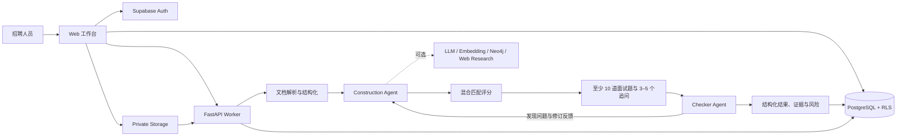

# 简历中台

前端展示层配合 Supabase 托管数据库、私有文件存储和登录鉴权；Python Worker 负责文档解析与规则匹配。

部署构建会从环境变量生成浏览器所需的 `supabase-config.js`，该文件和服务端密钥都不会提交到仓库。

## 开发背景

一线招聘的筛选，很少是「一份简历、一个明确结论」。一个岗位常常在几天内收到几十到上百份 PDF / Word / 扫描件；招聘人员只有很短时间决定要不要推进，用人经理又会追问「为什么是这几个人，依据在哪」。

纯人工阅读时，标准会随疲劳和班次漂移；纯关键词过滤又会漏掉同义表述，同时放行技能词堆砌、项目写不清的简历。进入面试后，面试官还往往要从零准备问题，把时间花在核实「了解、参与、预研」到底有没有做过。

简历中台按这个真实场景来做：把非结构化材料变成可比较、可追溯的优先级，标出硬门槛、原文证据和待验证风险。系统不作自动录用决定，只把初筛从「凭印象翻页」变成「带着证据开会」。

## 产品定位与最短闭环

**用户**：招聘人员与用人经理。**目标**：把 JD 和多份非结构化简历转为可追溯的候选人优先级，降低人工复核成本；系统不作自动录用决定。

最短演示闭环为：`1 份 JD + 多份简历 → 结构化解析 → 混合评分 → 原文证据与风险 → AI 质检 → 至少 10 道面试题 + 3–5 个追问 → 招聘人员复核`。

- 未配置 Supabase 时，页面可直接进入演示模式：点「查看示例结果」展示预制闭环；「运行真实样例」需要 `./dev.sh`。
- 配置本地环境后，`./dev.sh` 启动真实上传与 Worker；选择样例后点击「一键解析」走同一流程。

### AI 职责、Prompt 与兜底

| 环节 | AI/规则职责 | 不能完全相信的部分 | 兜底 |
| --- | --- | --- | --- |
| Construction | 提取 JD/简历结构、同义技能映射、生成匹配说明和面试题 | 年限推断、自述真实性、跨域迁移 | 硬门槛、原文引用、风险与追问 |
| Checker | 核对证据→分数→结论链路、数据假设、夸大表述、题目完整性 | Checker 本身也可能不可用或误判 | `recommend` 降为 `review`，公开问题严重度和修正建议 |
| 招聘人员 | 验证候选人自述，判断岗位/团队适配，做最终决策 | — | 面试、背调、用人经理复核 |

核心 Prompt 约束：只接受 JD 或简历原文作为候选人能力证据；“了解、参与、预研、Demo”不能等同于“精通、主导、生产级”；输出必须给出引用、假设、风险级别与修正建议。

## 架构与数据流



浏览器只持有 Supabase publishable/anon key；文件进入私有 Storage，结构化记录和 Agent 状态进入启用 RLS 的 PostgreSQL。Worker 执行解析、Construction、Checker 和持久化，Checker 最多触发一次有上限的修订闭环，避免无限自循环。

### Prompt 设计思路

- **数据与指令隔离**：JD/简历作为不可信 `DATA` 包裹，明确要求模型忽略文档中的指令，降低 Prompt Injection 风险。
- **证据先于结论**：候选人能力只能由 JD/简历原文支持；输出引用、假设、风险和置信度，禁止把“了解、参与、预研、Demo”升级成“精通、主导、生产级”。
- **结构化 Contract**：Construction 和 Checker 都只接受固定 JSON Schema，面试题必须包含考察点、难度和评分标准，便于校验和持久化。
- **失败闭合**：真实模型不可用、引用无法定位或 Checker 异常时，不伪装成功；推荐结论降为人工复核，确定性规则继续提供可演示结果。
- **有界修订**：Checker 输出问题类型、严重程度、修正建议和可执行 patch，最多回传 Construction 一次，再保留最终审计记录。

### 痛点如何落到实现

| 真实痛点 | 系统怎么处理 |
| --- | --- |
| 材料量大、格式不齐 | 解析 PDF / DOC / DOCX，扫描件自动 OCR；形成 JD 要求、候选人画像和原文证据 |
| 判断标准随人漂移 | 硬门槛冻结后不可改写；混合评分给出可解释分项，轨迹可复盘 |
| 关键词既误伤又误放 | 技能同义归一后再覆盖；堆砌技能词记为风险，不能单独换成生产级结论 |
| 表述膨胀，缺少证据 | 能力只能引用原文；独立 Checker 校验证据、分数和结论，最多回修一轮 |
| 过了初筛，面试仍从零开始 | 按候选人证据和缺口生成结构化问题与追问 |
| 简历敏感、不能自动录用 | 私有存储与 RLS；输出是优先级和风险，录用仍由人决定 |

浏览器只使用 Supabase `anon` key。`service_role` key 仅供 FastAPI Worker 使用，不能写入 `supabase-config.js` 或提交到仓库。

## 配置 Supabase

1. 创建一个 Supabase 项目，并按文件名顺序在 SQL Editor 执行 `supabase/migrations/` 下的全部 SQL。
2. 在 Authentication 中启用 Email 登录，创建至少一个用户。
3. 为该用户创建工作区和成员关系（把两个 UUID 替换为实际值）：

```sql
insert into public.workspaces (id, name)
values ('<workspace-uuid>', '默认工作区');

insert into public.workspace_members (workspace_id, user_id, role)
values ('<workspace-uuid>', '<auth-user-uuid>', 'owner');
```

4. 把 `supabase-config.example.js` 的内容复制到 `supabase-config.js`，填写 Project URL、anon key 与工作区 UUID。
5. 用静态服务器启动项目：

```bash
python3 -m http.server 4173
```

前端会在已有 Supabase 登录会话时启用真实文件上传；未配置时自动保留演示数据。

## 本地一键启动（推荐）

首次只需准备两件事：

1. `supabase-config.js`（从 `supabase-config.example.js` 复制，填好 url / anonKey / workspaceId）
2. 第一次运行 `./dev.sh` 时粘贴 Supabase 的 **service_role key**（只写入 `backend/.env`，不会进前端）

本地 Demo 若使用匿名登录自动加入工作区，还需：

- 执行迁移 `20260814020000_gate_anonymous_bootstrap.sql`
- **单独**执行 `scripts/enable-demo-anonymous.sql`（迁移本身不会自动打开匿名自助加入）
- 在 `supabase-config.js` 设置 `allowAnonymousBootstrap: true`

**生产环境请保持 `allow_anonymous_bootstrap=false` / `allowAnonymousBootstrap: false`**，并使用正式成员账号。
`claim_processing_task` 与 `purge_expired_screenings` 仅授予 `service_role`；viewer 角色只读。

之后每次开发：

```bash
./dev.sh
```

脚本会自动：

- 创建/补全 `backend/.env` 与 Python 依赖
- 生成 `supabase-config.worker.js`（前端自动连本地 Worker）
- 同时启动：静态页面、FastAPI Worker、任务队列循环
- 打开浏览器（默认 http://127.0.0.1:4174）

按 `Ctrl+C` 停止全部服务。

## 一键跑测试

仓库根目录：

```bash
./test.sh
```

或：

```bash
cd backend
python3 -m venv .venv
source .venv/bin/activate
pip install -r requirements-dev.txt
pytest
```

`requirements.txt` / `requirements-dev.txt` 使用锁定版本；根目录与 `backend/` 都配置了 `pytest.ini`（`pythonpath` 指向 `backend`）。

浏览器 smoke（演示模式、抽屉和 390px 视口）：

```bash
npm ci
npx playwright install chromium
npm run test:browser
```

## 启动 Worker（手动方式）

```bash
cd backend
python3 -m venv .venv
source .venv/bin/activate
pip install -r requirements.txt
cp .env.example .env
uvicorn app.main:app --reload --port 8000
```

配置 `.env` 中的 `SUPABASE_SERVICE_ROLE_KEY` 与 `INTERNAL_API_TOKEN`。Worker 主要接口：

```text
GET  /health
POST /internal/tasks/run-once          # 需 X-Internal-Token；调度器领取单任务
POST /internal/jobs/process            # 需 X-Internal-Token；跑完一个 job
POST /jobs/process                     # 需用户 Bearer；仅处理本人创建的 job
POST /dev/jobs/process                 # 仅 localhost + AGENT_MODE=mock 的本地一键解析
```

使用部署平台的定时任务或队列消费者调用 `POST /internal/tasks/run-once`，并携带 `X-Internal-Token`。每次调用会原子领取一个队列任务。

建议每分钟调用一次，或在任务高峰期以单消费者循环调用；不要让多个定时任务在同一秒重复触发，以免浪费 Worker 实例。

## Agent 模式与知识服务

默认 `AGENT_MODE=mock`，可在**不配置模型、Neo4j 或联网 Key**的情况下跑完整链路：

```text
结构化抽取 → Fact Claim → 混合评分 → 题目/追问 → Checker → 分级记忆
```

当前 mock Agent 是可测试的确定性替身，输出与后续真实模型一致的结构化 Contract。生产环境可逐步配置：

- `OPENAI_BASE_URL` / `OPENAI_API_KEY`：OpenAI 兼容模型接口；
- `EMBEDDING_MODEL`：仅填写 embedding 模型（如 `text-embedding-3-small`），不要填聊天模型；
- `NEO4J_URI` / `NEO4J_USER` / `NEO4J_PASSWORD`：Fact Graph 多跳关系；
- `TAVILY_API_KEY`：JD Research ReAct 的受控联网检索。

Supabase 保存原文件、权限、审计、Agent 轨迹和分级记忆；Neo4j 只保存可选的 Claim / Requirement 关系。规则分不读记忆。Checker 通过只写入 `model_checked`（`trusted=false`）；招聘人员确认证据才升为 `human_verified`。校准、流程结果和题型不得抬高后续分数。

信任分级：

- `model_checked`：Checker 结构/质量通过（**不等于事实正确**）
- `source_verified` / `human_verified`：才进入可信向量召回
- `expired` / `revoked` / `untrusted`：失效，最近条回退也不会捞回

## 数据与安全边界

- JD 和简历保存在私有 `screening-documents` Bucket，访问经由 RLS 与签名 URL。
- 单文件接受 PDF/DOC/DOCX，最大 10MB；服务端用文件魔数、DOCX ZIP 结构和 DOC OLE `WordDocument` 流再次校验。普通 PDF 直接读取文字层，缺少文字层的页面自动使用离线中英文 OCR；单个 PDF 最多 60 页，其中 OCR 页面最多 30 页。
- 本地 Demo（`./dev.sh`）通过 loopback `/dev/jobs/process` 触发 Worker，**不会**把 `INTERNAL_API_TOKEN` 写入浏览器可读配置。
- 处理中任务带 `lease_expires_at` 与不可预测的 `lease_token`：Worker 崩溃或平台超时后可被重新领取；失去租约的旧 Worker 不能完成、失败或续租新 owner 的任务。
- 表按 `workspace_id` 启用 RLS，浏览器不能跨工作区读取候选人数据。
- 匿名自动入组仅在 `allow_anonymous_bootstrap=true` 的 **本地 Demo 工作区** 生效；生产关闭该开关后需邮箱密码登录工作区成员账号。
- `audit_logs` 只保存操作元数据，不保存简历正文或模型提示词。
- 当前 SQL 包含任务状态、三次重试上限、lease 回收和失败状态。生产环境应设置定期清理任务，按组织的数据保留策略删除文件及关联数据。

例如可由 Supabase Cron 每天调用一次：

```sql
select public.purge_expired_screenings(30);
```

## 当前 Worker 能力

当前 Worker 在 mock 模式下使用确定性 Agent Contract：抽取岗位技能、年限、学历，提出带 Evidence 的 Claim，计算可解释的混合分数，生成题目/追问，并由 Checker 校验。真实 LLM、Neo4j 和 Tavily 未配置时会安全降级，不阻断本地开发。Checker 的失败/不可用会明确标记为降级，并仅把 `recommend` 降为 `review`。核心产物通过 `persist_screening_candidate_core` RPC 原子写入（`match_results` + `question_packs` + `checker_reviews`，可选 claims）；RPC 未迁移时回退为多表 upsert。核心不完整时任务与 `agent_runs` 均为 `failed`（`tracer.fail()`）。可选产物（memory / Fact Graph）失败只记 warning。Construction 有 `AGENT_MAX_REACT_STEPS` / `AGENT_MAX_LLM_CALLS`；全局另有 `LLM_MAX_CONCURRENT`、熔断与 `JOB_DEADLINE_SEC`（默认 280s，对齐 Vercel `maxDuration`）及 `TASK_LEASE_SEC`（默认 300s）。Judge 证据仅接受 JD/简历来源、会拦截否定语义与强度错配，并至少需要两条不重复、且包含候选人侧的证据。样例 DOCX 人工标签评测：`backend/scripts/run_sample_doc_eval.py`（门槛 ≥75%）。
Held-out 文档评测（解析真实 DOCX + 去标签泄漏，不作 100% 宣称）：`backend/scripts/run_heldout_doc_eval.py`。

## 已知边界与后续验证

- 当前离线评测用于回归，不能替代真实岗位与面试结果上的推荐准确率评估。
- 联网检索只补充岗位背景，绝不作为候选人能力证据。
- 真实 Supabase smoke 仅在专用测试项目、显式环境变量和专用测试账号下运行；生产密钥不会进入 CI。
- 后续应采集招聘人员对推荐、复核、面试题有效性的反馈，校准阈值与风险规则。
